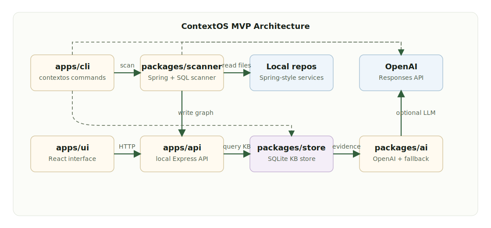
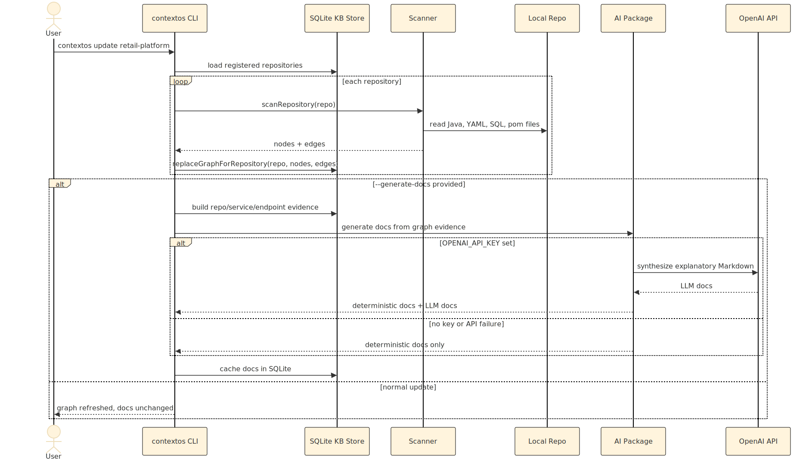
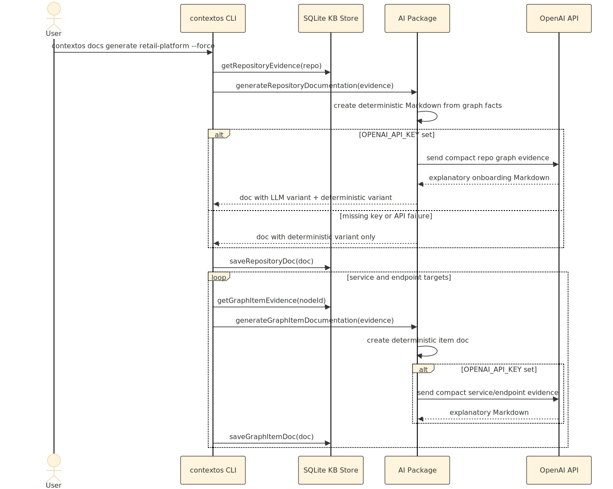
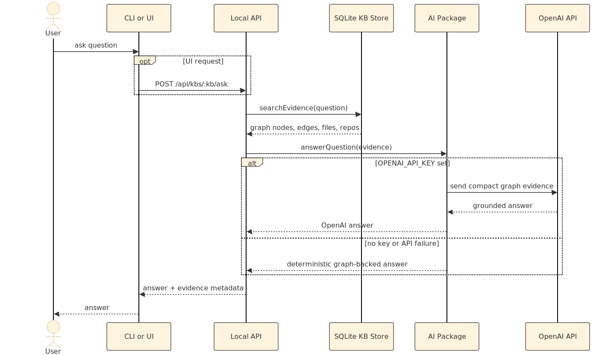
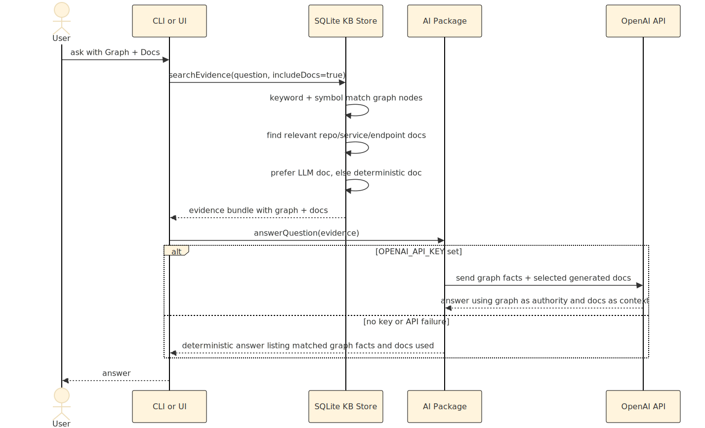
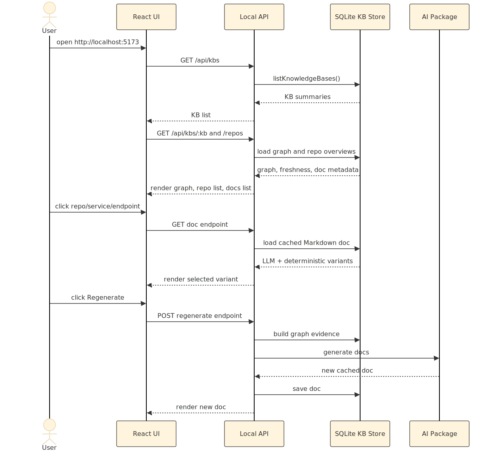

# ContextOS Architecture

ContextOS is a local-first knowledge graph for codebase onboarding and impact analysis. The scanner builds deterministic graph facts first, optional documentation generation turns those facts into Markdown onboarding docs, and ask flows use graph evidence with optional generated-doc context.

Knowledge bases are stored under `~/.contextos/kbs/<name>` by default. Set `CONTEXTOS_HOME=/custom/path` to store them elsewhere.

The MVP is a TypeScript npm workspace:

- `apps/cli`: Commander-based `contextos` CLI.
- `apps/api`: Express API for KB, ask, graph, and docs endpoints.
- `apps/ui`: Vite React UI.
- `packages/scanner`: heuristic Spring Boot-style repository scanner.
- `packages/store`: SQLite KB storage.
- `packages/ai`: OpenAI answer and documentation synthesis with deterministic fallback.

Diagram sources live in `docs/architecture/diagrams/*.mmd`, and rendered SVG images live beside them. Regenerate images after editing Mermaid sources with:

```bash
node docs/architecture/render-mermaid.mjs
```

## Component Diagram



Source: [component-diagram.mmd](architecture/diagrams/component-diagram.mmd)

## SQLite Contents

Each KB has a `contextos.db` file. The main data groups are:

- `schema_meta`: current local SQLite schema version and update timestamp.
- `repositories`: registered local repo paths and freshness timestamps.
- `nodes`: graph facts such as repositories, controllers, services, endpoints, entities, tables, topics, config files, and source files.
- `edges`: relationships such as `exposes`, `calls`, `consumes`, `writes`, `reads`, `contains`, and `depends_on`.
- `repository_docs`: cached repo onboarding docs in Markdown, storing both deterministic and LLM variants when available.
- `graph_item_docs`: cached service and endpoint docs in Markdown, also storing both deterministic and LLM variants.

For generated docs, ContextOS keeps deterministic facts and LLM docs side by side. UI docs default to the LLM version if present, and fall back to deterministic docs if not.

## UI And Graph Technology

The web UI is built with React and Vite. During development, `contextos ui` starts the API and Vite dev server together. For built/demo mode, `apps/api` serves static assets from `apps/ui/dist` while keeping `/api/*` routes ahead of the SPA fallback.

The dependency graph in the UI uses React Flow (`@xyflow/react`). Nodes are grouped by existing ContextOS categories such as repository, controller, service, endpoint, client, table, topic, config, and file. Edges come from the SQLite graph and represent scanner-derived relationships such as `contains`, `exposes`, `calls`, `reads`, `writes`, `publishes`, `consumes`, and `depends_on`.

The architecture diagrams in this document are authored in Mermaid and rendered to local SVG files by `docs/architecture/render-mermaid.mjs`.

## Update Flow

`contextos update <kb>` refreshes graph facts only. It does not call OpenAI unless `--generate-docs` is passed.



Source: [update-flow.mmd](architecture/diagrams/update-flow.mmd)

## Documentation Generation Flow

`contextos docs generate <kb> --force` regenerates repository, service, and endpoint docs from the current graph. This is the preferred demo command after setting `OPENAI_API_KEY`.



Source: [docs-generation-flow.mmd](architecture/diagrams/docs-generation-flow.mmd)

## Ask Flow

The default ask path uses graph evidence only. This is best for impact analysis because graph facts are the source of truth. The API exposes both a normal JSON ask endpoint and an SSE streaming endpoint. The UI uses the streaming endpoint so OpenAI token deltas can render as they arrive, while the CLI continues to use the stable JSON path.



Source: [ask-flow.mmd](architecture/diagrams/ask-flow.mmd)

## Ask With Docs Flow

`contextos ask <kb> "<question>" --with-docs` and the UI `Graph + Docs` toggle include generated docs as additional explanatory context.

The evidence priority is:

1. Graph facts from nodes, edges, files, and repositories.
2. LLM docs for matched repositories, services, and endpoints, if available.
3. Deterministic docs for matched items when LLM docs are missing.

ContextOS sends one doc variant per matched item. It prefers `llmMarkdown`, then falls back to `deterministicMarkdown`, then `markdown`.



Source: [ask-with-docs-flow.mmd](architecture/diagrams/ask-with-docs-flow.mmd)

## UI Flow



Source: [ui-flow.mmd](architecture/diagrams/ui-flow.mmd)

## Fallback Behavior

- Scanning and graph storage never require OpenAI.
- `contextos update <kb>` scans only by default.
- `contextos update <kb> --generate-docs` scans and then runs documentation generation.
- `ask` works without OpenAI by returning a deterministic graph-backed answer.
- Streaming ask also falls back through the same deterministic answer and emits a final result event.
- `docs generate` works without OpenAI by generating deterministic Markdown docs.
- If OpenAI succeeds, generated docs store both variants and the UI defaults to LLM docs.
- If OpenAI fails, existing graph data remains usable and deterministic docs/answers are still available.

## Current Tradeoffs

- Parsing is heuristic and optimized for Spring Boot-style Java services.
- Retrieval uses keyword and symbol matching, not embeddings.
- Docs are cached Markdown, not source-of-truth facts.
- Graph facts remain authoritative; LLM docs are explanatory context for onboarding and richer Q&A.
